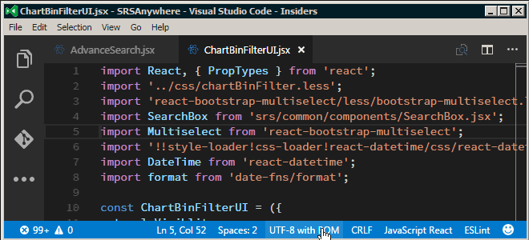

# Contributing to Mobile

First off, welcome to the team! ![party]

[party]: https://assets-cdn.github.com/images/icons/emoji/unicode/1f389.png

The following is a set of guidelines for contributing to Mobile.
It is expected that you do your best to adhere to standards set forth in this document.
Where applicable, we will do our best to accommodate these standards through automated mechanisums,
reducing the burden on the contributor.

If you feel you must deviate from the standards please bring it up for discussion
before implementing. Thanks, & Have fun!

## Setup your Environment

See the [development section](./docs/development/README.md) of the [documentation](./docs/README.md)

## Styleguides

- [JavaScript and JSX](https://github.com/airbnb/javascript)
  - [Be sure to see our overrides](./docs/development/StyleOverride.md)
- [Bootstrap](http://getbootstrap.com/css/)
- [Font Awesome](http://fontawesome.io/icons/)
- [Clean Code JavaScript](https://github.com/ryanmcdermott/clean-code-javascript)
  - Everything in the above article is generally good advice, but the following items should have some extra attention:
  - **Prefer composition over inheritance**.
  - Avoid using JS `class` as often as possible, unless you need state in your object or must have inheritance for some reason.
  - **Favor functional programming of imperative programming.**
  - For Redux-Saga use `_` to mark private generator methods as part of the private API. *It is necessary to expose these pieces for testing.*
- [Generate Fonts for Custom Icons](https://icomoon.io/app/#/select)

### File Encoding

- [UTF-8 without BOM](https://github.com/Microsoft/vscode/issues/751#issuecomment-191857334)

### URLs

- ~~don't include the protocol (http or https) in rendered urls~~
  - ~~yes: `//srsapi.com`~~
  - ~~no: `http://srsapi.com`~~
  - ~~no: `https://srsapi.com`~~

**UPDATE**: Protocol relative URLs are now considered an anti-pattern. [We need to use HTTPS wherever possible.](https://www.paulirish.com/2010/the-protocol-relative-url/)

## Testing

Strive to unit test all your code.

We're using [Mocha](https://mochajs.org/) for running our unit tests
and Michael Jackson's [expect](https://github.com/mjackson/expect) library for assertions.
We're also using [enzyme](https://github.com/airbnb/enzyme/tree/master/docs) for testing React components
