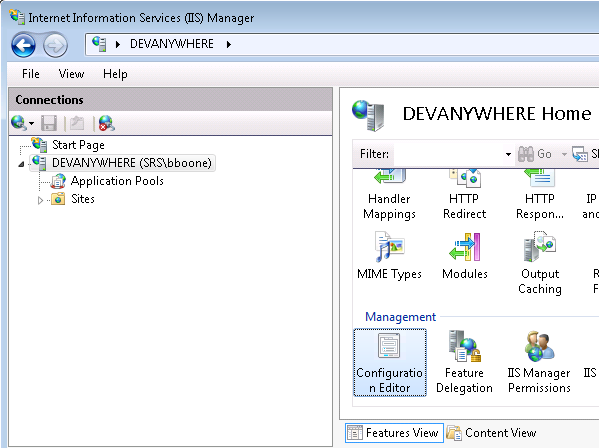

# IIS Deployment

## URL

This is the expected URL for a developer's and QA's environment

[http://localhost/SRSUI/Mobile/](http://localhost/SRSUI/Mobile/)

## Redirect from root

This should be placed in the `web.config` at the root of the website (inetpub\wwwroot).

This redirects anyone that visits `http://[servername]` to `http://[servername]/SRSUI/Mobile`

```xml
<httpRedirect enabled="true" destination="/SRSUI/Mobile" childOnly="true" />
```

## URL Rewriting

This should be placed in the `web.config` at the root of the website (inetpub\wwwroot).
You will need the [URL Rewrite module](http://www.iis.net/downloads/microsoft/url-rewrite) to be installed in IIS

```xml
<?xml version="1.0" encoding="UTF-8"?>
<configuration>
    <system.webServer>
        <rewrite>
			<rules>
				<rule name="HTTP to HTTPS redirect" stopProcessing="true">
                    <match url="(.*)" />
                    <conditions>
                        <add input="{HTTPS}" pattern="off" ignoreCase="true" />
                    </conditions>
                    <action type="Redirect" url="https://{HTTP_HOST}/{R:1}"
                        redirectType="Permanent" />
                </rule>
                <rule name="MobileSilentRenew" stopProcessing="true">
                    <match url="^SRSUI/Mobile/silent_renew$" />
                    <action type="Rewrite" url="/SRSUI/Mobile/silent_renew.html" />
                </rule>
                <rule name="MobileStatic" stopProcessing="true">
                    <match url="^SRSUI/Mobile/static/(.+)$" />
                    <conditions logicalGrouping="MatchAll" trackAllCaptures="false" />
                    <action type="None" />
                </rule>
                <rule name="MobileSPA" stopProcessing="true">
                    <match url="^SRSUI/Mobile/(.*)$" />
                    <conditions logicalGrouping="MatchAll" trackAllCaptures="false" />
                    <action type="Rewrite" url="/SRSUI/Mobile/index.html" />
                </rule>
            </rules>
			<outboundRules>
                <rule name="Add Strict-Transport-Security when HTTPS" enabled="true">
                    <match serverVariable="RESPONSE_Strict_Transport_Security"
                        pattern=".*" />
                    <conditions>
                        <add input="{HTTPS}" pattern="on" ignoreCase="true" />
                    </conditions>
                    <action type="Rewrite" value="max-age=31536000" />
                </rule>
            </outboundRules>
        </rewrite>
    </system.webServer>
</configuration>
```

### Mime Type configuration

- `.woff` : `application/font-woff`
- `.woff2` : `application/font-woff2`

```xml
<system.webServer>
  <staticContent>
    <remove fileExtension=".woff" />
    <remove fileExtension=".woff2" />
    <mimeMap fileExtension=".woff" mimeType="application/font-woff" />
    <mimeMap fileExtension=".woff2" mimeType="application/font-woff2" />
  </staticContent>
</system.webServer>
```

## Compression

1. Install Dynamic Content Compression
    - Navigate to:
      1. Server Manager
      1. Roles
      1. Web Server (IIS)
      1. Add Role Services
      1. Web Server
      1. Performance
      1. Dynamic Content Compression
1. Enable Content Compression
    1. Open IIS and open the Configuration Editor for the Server
    
    1. Add `application/json` and `applicaiton/xml` to the `dynamicTypes` array.
    1. Add `application/javascript` and `text/javascript` to the `staticTypes` array
    1. Set `dynamicCompressionEnableCpuUsage` to 0
    1. Set `staticCompressionEnableCpuUsage` to 0
    1. Restart IIS
1. Add the following web.config to the root folder of Mobile
```xml
<?xml version="1.0" encoding="UTF-8"?>
<configuration>
    <system.webServer>
        <urlCompression doDynamicCompression="true" />
    </system.webServer>
</configuration>
```

## Caching

Add the following Web.config to the `static` folder of Mobile

Static files are effectively cached forever (with the exception of index.html which should never be cached).
When index.html is updated, it will contain a set of unique URLs which act as a cache buster,
forcing the browser to retrieve the new files.


```xml
<?xml version="1.0" encoding="UTF-8"?>
<configuration>
    <system.webServer>
        <staticContent>
            <clientCache cacheControlMode="UseMaxAge" cacheControlMaxAge="30.00:00:00" />
        </staticContent>
    </system.webServer>
</configuration>
```